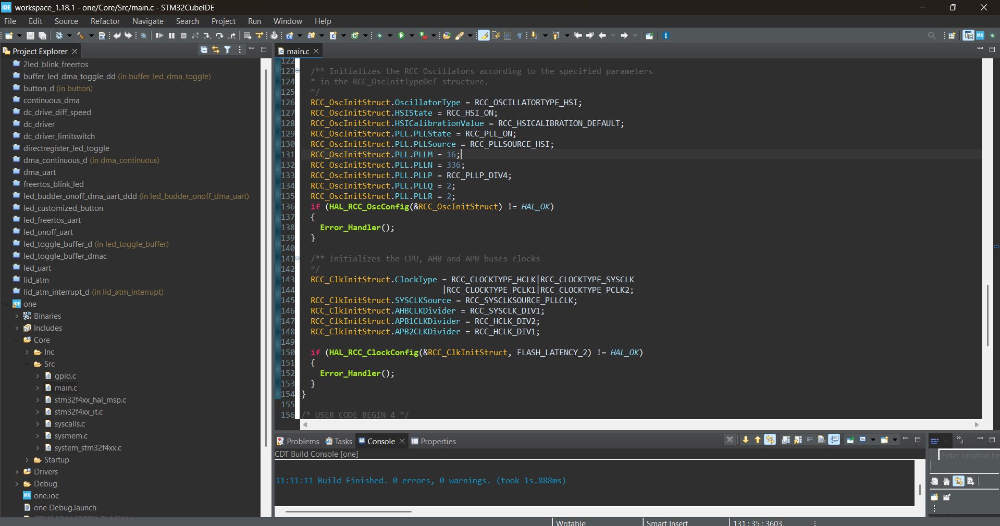

# Blink_led_stm32
# STM32 Nucleo F446RE LED Blinking Project

This project toggles an onboard LED using STM32CubeIDE and runs on the STM32 Nucleo-F446RE board.

## Board Used
- STM32 Nucleo-F446RE

## Tools
- STM32CubeIDE
- HAL drivers

## Functionality
- Blinks LED connected to pin PC1 (or change based on your pin setup)

## How to Use
1. Clone or download the project
2. Open with STM32CubeIDE
3. Build and flash to board
4. Observe the LED blinking
## Screenshot 

## Author
- Deva Nanda S
